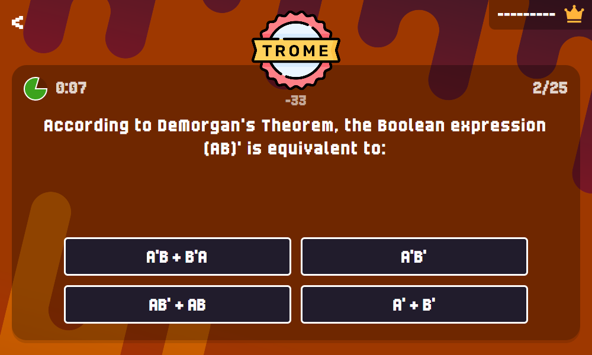

# TROME



Trome was created and submitted as part of the Magshimim National Cyber Program 2nd year final project by Itay Herskovits and Stav Solomon.

## 📚 Table of Contents

- [📌 Features](#-features)
- [🎁 Bonuses](#-bonuses)
  - [✅ Official](#-official)
  - [🛠️ Custom](#-custom)
- [🧰 Installation & Setup](#-installation--setup)
- [🏗️ Server Infrastructure](#-server-infrastructure)
  - [🧠 State Management](#-state-management)
    - [📍 States](#-states)
    - [🔁 Transitions](#-transitions)
  - [🧩 Codec Model](#-codec-model)
    - [📬 Message Structure (Protocol)](#-message-structure-protocol)
    - [🧾 Request](#-request)
    - [🧾 Response](#-response)
    - [📦 Body Content](#-body-content)
    - [📡 Notifications System](#notifications-system)
- [🔐 Cryptography Overview](#-cryptography-overview)
  - [🔑 Current Encryption Method: RSA (Asymmetric)](#-current-encryption-method-rsa-asymmetric)
  - [🛠 Other Encryption Method](#-other-encryption-method)
    - [🟡 AES (Advanced Encryption Standard)](#-aes-advanced-encryption-standard)
    - [🟡 OTP (One-Time Pad)](#-otp-one-time-pad)

---

# 📌 Features

- Cross-platform server & client
- 2 Gamemodes
    - Trivia Rush
    - Head-to-Head
- User-defined questions
- Player kicking
- BGM !!

## 🎁 Bonuses
Features explicitly deemed as a bonus by Magshimim, as well as additional, custom ones we simply wanted to add:

### ✅ Official
- Regexes
    - Signup validation with regexes using the [Compile Time Regular Expressions](https://github.com/hanickadot/compile-time-regular-expressions) library
- Singletons
    - The transformation of the following classes to use the Singleton pattern:
        - `Server`
        - `Database`
        - `CommonCommunicator`
        - `WindowsCommunicator`
        - `UnixCommunicator`
    - The transformation of the following classes to use the Static Class pattern:
        - `JsonRequestPacketDeserializer`
        - `JsonResponsePacketSerializer`
- MongoDB
- Pulling questions from [OpenTDB](https://opentdb.com/) into the database
- User-defined questions
- Head-to-Head gamemode
    - Pre-game countdown
- Cryptography
    - OTP
    - Crypto++
        - RSA
        - AES

### 🛠️ Custom
- CMake-aligned project
- Cross-platform support for Windows/Unix
- Notifications system
- Avalonia
- Harmonically syncing BGM w/ [NAudio](https://github.com/naudio/NAudio)
- Viewing player statistics in-game
- Player kicking
- SQLite Prepared Statements & Bindings

# 🧰 Installation & Setup

First, clone this repository:

```bash
git clone https://gitlab.com/Tomgluz/Trivia_Itay_Stav_2025.git
```

## 🖥️ Server Setup

### 📦 Dependencies

#### 🪟 Windows

Install `VCPKG` directly under your C drive:

```powershell
cd C:\

# Clone the repository
git clone https://github.com/microsoft/vcpkg.git

# Run the bootstrap script
cd vcpkg; .\bootstrap-vcpkg.bat
```

When done, run the following command to install all required dependencies:

```powershell
.\vcpkg install openssl cryptopp
```

> [!NOTE]
> If you're using **MongoDB**, also run:
> ```powershell
> .\vcpkg install mongo-cxx-driver
> ```


#### 🐧 Unix

Install the following development packages:

- OpenSSL
- Crypto++
- **If using MongoDB:** MongoDB C++ Driver

> [!NOTE]
> Package names may vary depending on your package manager and distribution.

### 🏗️ Building

In the project directory, under Server:

- If a build directory is not present, create one.
- CD into it.

```bash
cmake ../
cmake --build ./
```

### 🌿 Using MongoDB (Optional)

> [!NOTE]
> Using MongoDB will *replace* the usage of Sqlite.

Look for the following line in `CMakeLists.txt`, and switch the `OFF` statement to an `ON`:
```cmake
# If you want to use MongoDB instead of Sqlite, make this ON:
set (USE_MONGO_DB OFF)
```

> [!IMPORTANT]
> The file `./resources/mongodb_connection_string.txt` **must** be present in that case,
> containing the connection string to **your own** MongoDB database.
>
> The server will **automatically** create and populate all the necessary collections for you.

## 💻 Client

Within the Client directory, run the following for your operating system of choice (self-contained):

### 🪟 Windows

```bash
dotnet publish -c Release -r win-x64 --self-contained true /p:PublishSingleFile=true /p:IncludeNativeLibrariesForSelfExtract=true
```

### 🍎 MacOS

```bash
dotnet publish -c Release -r osx-x64 --self-contained true /p:PublishSingleFile=true
```

### 🐧 Linux

```bash
dotnet publish -c Release -r linux-x64 --self-contained true /p:PublishSingleFile=true
```

# 🏗️ Server Infrastructure

## 🧠 State Management

### 📍 States

| State Name              | Purpose                        | Description                                                                                                                                                                                                                                     |
|-------------------------|--------------------------------|-------------------------------------------------------------------------------------------------------------------------------------------------------------------------------------------------------------------------------------------------|
| `Login`                 | Initial state / Authentication | The client has just connected and is not yet aligned with a user                                                                                                                                                                                |
| `Menu`                  | Menu                           | The main hub for all primary actions, such as joining a room, viewing statistics, etc.                                                                                                                                                          |
| `Room Member`           | Waiting room                   | The waiting state for all room guests for when until the room admin wishes to start the game. The user may request to see the room data and the statistics of the users that are in the room. Leaving the room will notify everyone else in it. |
| `Room Admin`            | Waiting room                   | Same as the `Room Member` State, but may also perform admin actions; kick players, change the room data and start the game. As an admin, leaving the room will close it & notify others.                                                        |
| `Game`                  | Playing the game               | The actual game state. Can request questions and submit answers. Leaving it prompts the same behavior as `Room Member` and `Room Admin` (if the client is the admin of the room).                                                               |
| `Finished Game Early`   | Waiting place                  | The player has finished answering all questions, though some players did not. Leaving behaves the same as in the `Game` state.                                                                                                                  |

---

### 🔁 Transitions

| From                  | To                    | Trigger/Event                  | Description                                       |
|-----------------------|-----------------------|--------------------------------|---------------------------------------------------|
|                       | `Login`               | Starting the client            | The client was connected.                         |
| `Login`               | `Menu`                | Login / Signup                 | The client has been authenticated.                |
| `Menu`                | `Login`               | Logout                         | User logged out.                                  |
| `Menu`                | `Room Member`         | Join room                      | User joined a room.                               |
| `Menu`                | `Room Admin`          | Create room                    | User created a room.                              |
| `Room Member`         | `Menu`                | Leaving / Kicked / Admin left  | User going back to the menu.                      |
| `Room Admin`          | `Menu`                | Closing room                   | User going back to the menu and closing the room. |
| `Room Member/Admin`   | `Game`                | Admin started the game         | Game was started.                                 |
| `Game`                | `Finished Game Early` | User finished the current game | User finished the game.                           |
| `Finished Game Early` | `Room Member/Admin`   | Game finished                  | End of game.                                      |

---

## 🧩 Codec model

### 📬 Message structure (Protocol)

#### 🧾 Request

| Field          | Size     | Description                                            |
|----------------|----------|--------------------------------------------------------|
| `Message Code` | 1 byte   | Message code identifier                                |
| `Length`       | 4 bytes  | Length of the body in bytes (For the example: N bytes) |
| `Body`         | N bytes  | The data                                               |


#### 🧾 Response

| Field          | Size     | Description                                            |
|----------------|----------|--------------------------------------------------------|
| `Message Type` | 1 byte   | Message type identifier (Response / Notification)      |
| `Message Code` | 1 byte   | Message code identifier                                |
| `Length`       | 4 bytes  | Length of the body in bytes (For the example: N bytes) |
| `Body`         | N bytes  | The data                                               |

#### 📦 Body Content

The content of the `Body` field depends on the message type. It may include:

- 🧾 **Strings** – Textual data (e.g., usernames, passwords)
- 🆔 **Identifiers** – User IDs, etc.
- ❓ **Questions** – Trivia questions
- 🏆 **Scores** – Numeric performance indicators

All body content is:
- Formatted in **JSON**
- 🔐 **Encrypted** using the predetermined cryptographic scheme

### 🔔 Notifications System

Simply defined as a *"response with no request"*.

They are a replacement for client-initiated polling request, prompting instead for *server-initiated, pushing* packets. 

Examples of such packets are admins notifying clients when the game has begun, guests notifying other room guests upon
their departure, etc.

---

## 🔐 Cryptography Overview

This project uses modern cryptographic techniques to ensure secure communication between the **Server** and **Client**.
Most the encryption/decryption operations are powered by the [Crypto++](https://www.cryptopp.com/) library and .NET
[System.Security.Cryptography](https://learn.microsoft.com/en-us/dotnet/api/system.security.cryptography?view=net-9.0).

> [!CAUTION]
> The keys are static, and are therefore not fully secure.  
> DO NOT use this as an example for actual Cryptography matters without making these files at runtime.
> We did it that way because `Crypto++` and `System.Security.Cryptography` RSA keys are not fit for each other, hence they were both made via OpenSSL.
 
---

### 🔑 Current Encryption Method: RSA (Asymmetric)

- **Algorithm**: RSA (1024-bit keys)
- **Library**: `Crypto++` and  `System.Security.Cryptography`
- **Usage**: Used to encrypt session secrets and sensitive data.
- **Key Management**:
  - **Server** and **Client** each have their own RSA private key and the other public key.
  - Public/private keys are stored in `.pem` files.
  - Keys are loaded **at startup** from the files.

### 🛠 Other Encryption Method

#### 🟡 AES (Advanced Encryption Standard)

- **Algorithm**: AES-256 in CBC mode
- **Library**: `Crypto++` and  `System.Security.Cryptography`
- **Use Case**: Once a session is established using RSA, AES can encrypt bulk data with lower computational cost.

#### 🟡 OTP (One-Time Pad)

- **Use Case**: For lightweight or critical communications requiring unbreakable encryption (if keys are truly random and never reused).
- **Library**: None
- **Limitations**: Requires secure key exchange and perfect synchronization.

---
